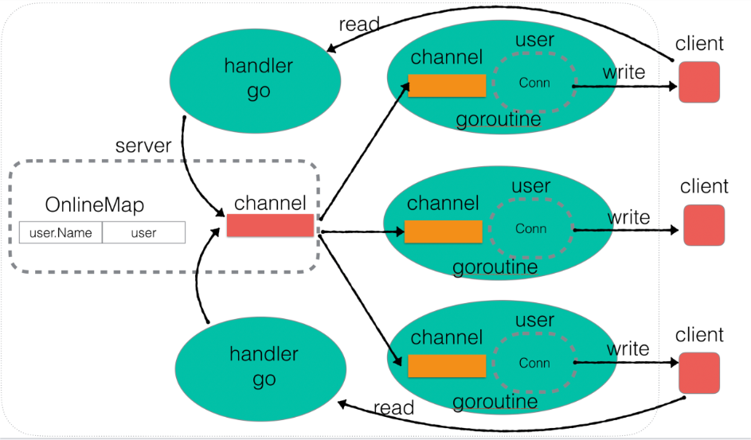

# Instant Messaging System

## Project Description

This is a simple Instant Messaging System developed entirely in the Go programming language. The system enables real-time communication between users, offering features such as basic server-client interactions, user online status tracking, public and private messaging, as well as client-side functionality for a seamless user experience.



## Key Features

- **Real-time Communication:** Enables instant messaging between users, allowing for seamless and quick interactions.
- **User Online Status Tracking:** Monitors and tracks the online status of users, providing a dynamic view of active participants.
- **Public and Private Messaging:** Supports both public chat for group discussions and private messaging for one-on-one conversations.
- **Concurrent Server-Client Interaction:** Leverages Go's concurrency capabilities to handle multiple clients concurrently, ensuring efficient communication.
- **User-Friendly Command-Line Interface:** The client interface is designed for ease of use, with clear command-line menus for intuitive navigation.

## Directory Structure

```ps
Instant messaging system/
│
├── client.exe                # Client executable file
├── client.go                 # Client source code file
├── go.mod                    # Go module file
├── main.go                   # Server main program entry file
├── Overall_Architecture.png  # Overall architecture diagram
├── README.md                 # Project documentation (current file)
├── server.exe                # Server executable file
├── server.go                 # Server source code file
└── user.go                   # User-related source code file
```

## To run

- Build server:

```pseudocode
go build -o server server.go main.go user.go
```

- Build client:

```pseudocode
go build -o client client.go
```

- Run server:

```pseudocode
./server.exe
```

- Run client:

```pseudocode
./client.exe
```


